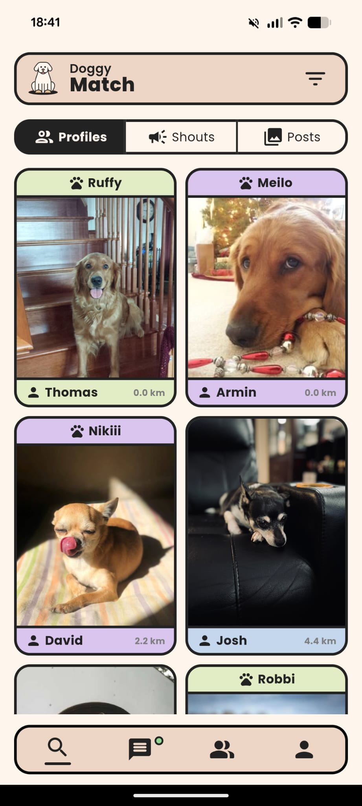
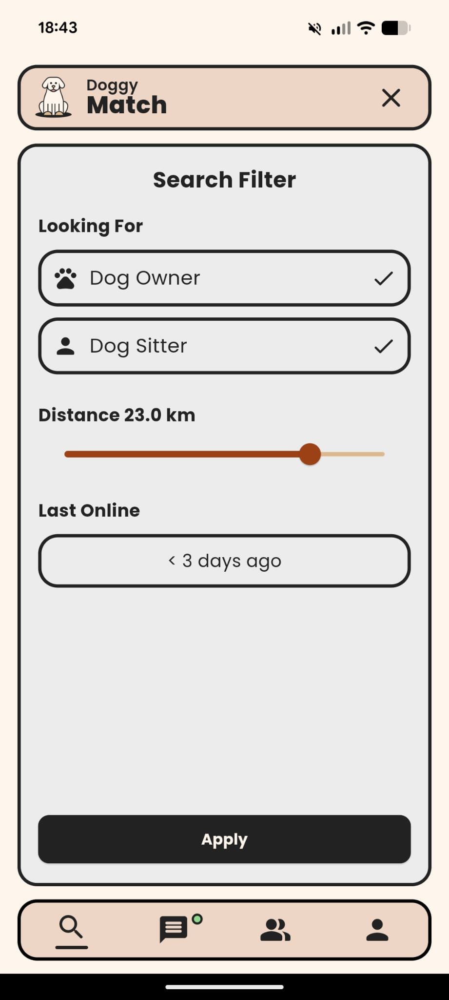
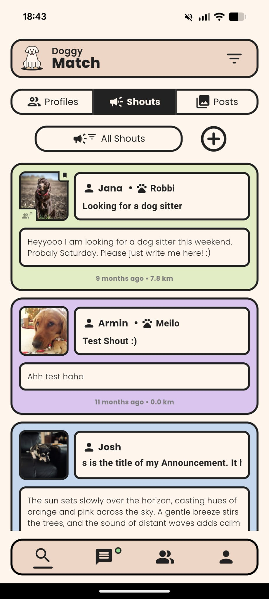
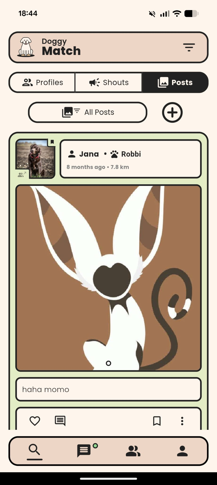
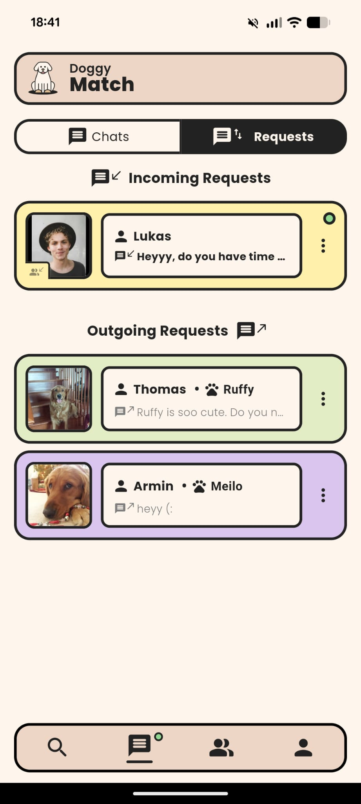
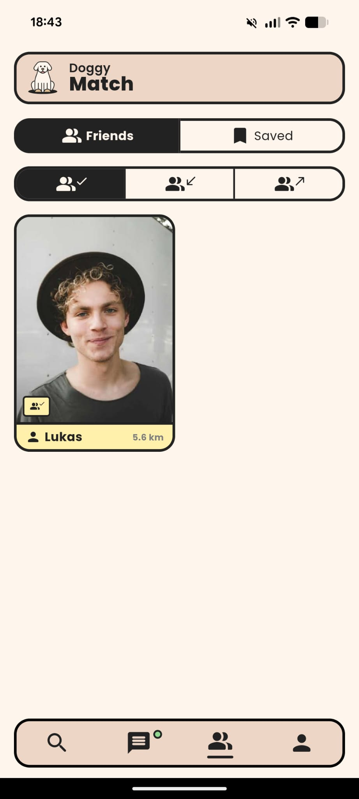
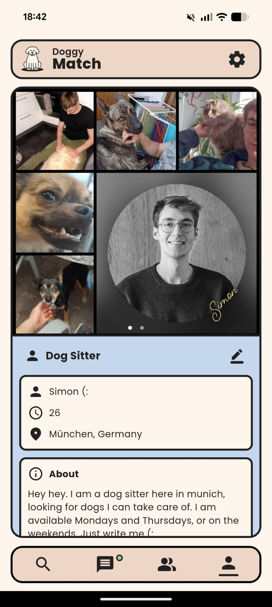
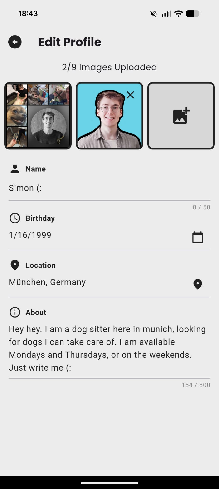
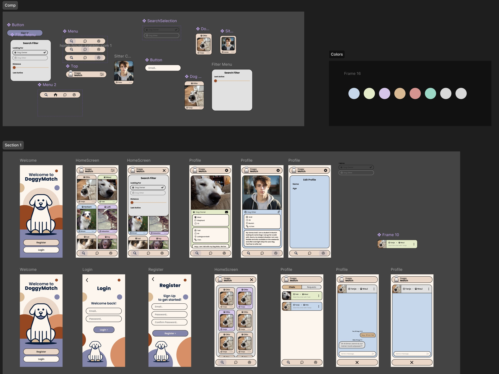

# 🐾 DoggyMatch

DoggyMatch is a full-fledged **social networking app** I built with **Flutter** and **Firebase** that connects **dog owners** with **dog sitters**, and also helps owners connect with each other.  

I started this project as a way to **teach myself mobile app development** and explore how to build a cross-platform application from the ground up.  
What began as a learning project eventually became a **fully functional social media app** with working chats, posts, friends, and more.  

## ✨ Features

### 🔍 Search Screen
- Find users nearby with distance filters  
- Switch between **dog owners** and **dog sitters**  
- Filter by **last online time**  
- View **Shouts**: announcements (e.g. “Urgently looking for a dog sitter this Saturday”)  
- View **Posts**: photos & descriptions, with like & comment functionality  

### 💬 Chat Screen
- Real-time chat powered by Firebase  
- Handle **chat requests** (send, receive, accept)  
- Smooth management of conversations and connections  

### 👥 Community Screen
- See your **friends list**  
- Manage **friend requests** (incoming & outgoing)  
- Save profiles for later  

### 🐶 Profile Screen
- Personal profile with **user info and dog details**  
- Upload photos  
- Manage your own **shouts** and **posts**  
- Full profile editing functionality  

---

## 🛠️ Tech Stack

- **Flutter** – Cross-platform development for Android & iOS  
- **Firebase** – Authentication, Firestore, Storage, and Realtime updates  
- **Figma** – UI/UX planning and frontloading before development  

Through this project I gained extensive hands-on experience with:
- Account creation & authentication flows  
- Image/file upload & handling  
- Real-time chatroom management  
- Building scalable **social media features** from scratch  

---

## 📸 Screenshots

| Screen | Preview |
|--------|---------|
| Search – nearby profiles |  |
| Search – filter menu |  |
| Search – shouts |  |
| Search – posts |  |
| Chat – requests view |  |
| Community – friends & saved |  |
| Profile – own profile |  |
| Profile – edit |  |
| Figma board |  |

---

## 🚀 Why This Repo Exists

DoggyMatch was never intended as a commercial release – it was a **learning playground** for me to dive deep into app development.  
Instead of keeping it private, I’ve made this repository public so that:
- Others can learn from a **complete social media app example** in Flutter  
- I can use it as a **reference project** for architecture and implementation patterns  
- It showcases my **technical growth** and exploration of Flutter + Firebase  

---

## 📬 Feedback

If you have ideas, questions, or feedback, feel free to open an issue or reach out.  
This project was built with passion for dogs 🐕 and curiosity for software 📱.

---
